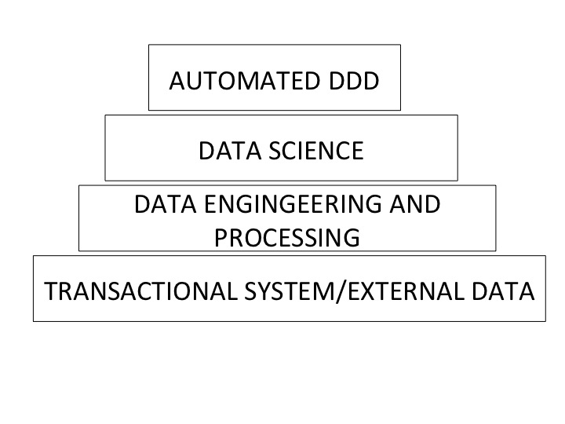

#**Technology Fundamentals for Analytics**
##Jason Kuruzovich
---

#Agenda
1. Continue presentation from last time
2. Nested relationships in databases and analytics
3. Introduction to relational databases
4. Movies

---



---
#What are the objectives of transactional systems?

---
#Transactional systems have to ensure data represents reality


---
#normalization slides

----

#Types of problems
1. Classification
2. Regression
3. Similarity
4. Clustering
5. Co-occurence grouping
6. Profiling
7. Link prediction
8. Data reduction
9. Causal modeling

---
# Classification
-Will respond to discount promotion vs will not respond to discount promotion
-

---
#Relationships Between Data
1. Levels of Analysis 
2. Relational View (Database)
2. Semantic/Object View [Later]

---
#What do we mean by "levels of analysis"?
The term "level of analysis" is used in the social sciences to point to the location, size, or scale of a data.
It is often relevant to ensure variables  
---
#Levels of analysis


---
#[fit]What is a relational database?

---
#Relational Databases


---
#[fit]What is a relational database?


---
#Relational Databases
"A relational database is a database that stores information about both the data and how it is related. "In relational structuring, all data and relationships are represented in flat, two-dimensional table called a relation."[1] For example, organizations often want to store and retrieve information about people, where they are located and how to contact them. Often many people live or work at a variety of addresses. So, recording and retrieving them becomes important—relational databases are good for supporting these kinds of applications."
[*Source: Wikipedia*](http://en.wikipedia.org/wiki/Relational_database)


---


---
#Data and Movies


---
#What is a movie producer?

---
#**What might a movie producer be interested in predicting?**

---
#**How might standard deviation and mean both be relevant?**


---
#**What data is available the might be relevant?**

---

#**What data is available the might be relevant?**

---

#**What data is available the might be relevant?**

---
#**The Internet Movie Database**


---
#Lab on IMDB
1. Install Python.
[`https://www.python.org/downloads/`](https://www.python.org/downloads/)

2. Install SQLObject from command line.
`easy_install -U SQLObject`

3. Use Filezilla to download from [IMDB](http://www.imdb.com/interfaces)

4. gzip -d *.gz
https://github.com/ameerkat/imdb-to-sql 
---

---
## R Markdown

This is an R Markdown presentation. Markdown is a simple formatting syntax for authoring HTML, PDF, and MS Word documents. For more details on using R Markdown see <http://rmarkdown.rstudio.com>.

When you click the **Knit** button a document will be generated that includes both content as well as the output of any embedded R code chunks within the document.

---
## Slide with Bullets

- Bullet 1
- Bullet 2
- Bullet 3

---
## Slide with R Code and Output

```r
summary(cars)
```

---
## Slide with Plot

```r
plot(cars)
```


